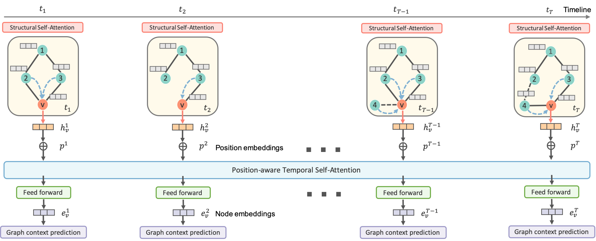

## DySAT: Deep Neural Representation Learning on Dynamic Graphs via Self-Attention Networks.

##### Contributors: [Aravind Sankar](http://asankar3.web.engr.illinois.edu/) (asankar3@illinois.edu).

> Aravind Sankar, Yanhong Wu, Liang Gou, Wei Zhang, and Hao Yang, "DySAT: Deep Neural Representation Learning on Dynamic Graphs via Self-Attention Networks", International Conference on Web Search and Data Mining, <b>WSDM 2020</b>, Houston, TX, February 3-7, 2020.


This repository contains a TensorFlow implementation of DySAT - Dynamic Self Attention (DySAT) networks for 
dynamic graph representation Learning. DySAT is an unsupervised graph embedding 
model to learn node embeddings in dynamic time-evolving attributed graphs, which may later be used for downstream application tasks such as link prediction, clustering and node classification.

Note: Though DySAT is designed for attributed dynamic graphs, our benchmarking experiments are carried out on datasets that do not have node attributes.
 




### Incremental Dynamic Graph Embedding

To support streaming graph applications, we also provide an implementation of Incremental 
Self-Attention (IncSAT) Networks to learn dynamic incremental node embeddings in a stage-wise fashion. 
See our extended [arxiv version](https://arxiv.org/pdf/1812.09430.pdf) for details on the algorithm.


If you make use of this code or the DySAT algorithm in your work, please cite our papers:

```angular2
@article{sankar2018dynamic,
  title={Dynamic Graph Representation Learning via Self-Attention Networks},
  author={Sankar, Aravind and Wu, Yanhong and Gou, Liang and Zhang, Wei and Yang, Hao},
  journal={arXiv preprint arXiv:1812.09430},
  year={2018}
}

```
```angular2
@inproceedings{sankar2020dysat,
  title={DySAT: Deep Neural Representation Learning on Dynamic Graphs via Self-Attention Networks},
  author={Sankar, Aravind and Wu, Yanhong and Gou, Liang and Zhang, Wei and Yang, Hao},
  booktitle={Proceedings of the 13th International Conference on Web Search and Data Mining},
  pages={519--527},
  year={2020}
}
```
### Requirements:

Recent versions of TensorFlow (<= 1.14), numpy, scipy, sklearn, and networkx (<= 1.11) are required.
The code has been tested under Python 2.7. The required packages can be installed using the following
command:

``$ pip install -r requirements.txt``

To guarantee that you have the right package versions, you can use Anaconda to set up a virtual environment and install the dependencies from ``requirements.txt``.


### Input Format

In order to use your own data, you have to provide:

- ``graphs``: list of networkx graphs (or multigraphs) for each time step, saved as `.npz` files. Have a look at the ``load_graphs()`` and ``load_feats()``  functions in ``utils/preprocess.py`` for an example.

- ``features``: list of ``N x D`` feature matrices (``N`` is the number of nodes and ``D`` is the number of features per node) in scipy sparse format) -- optional.

### Repository Organization
- ``data/`` contains the necessary input file(s) for each dataset after pre-processing.
- ``raw_data/`` contains data pre-processing jupyter notebooks for reference.
- ``models/`` contains the implementation of two models - ``DySAT`` and ``IncSAT``.
- ``utils/`` contains:
    - preprocessing subroutines (``preprocess.py``, ``utilities.py``, ``random_walk.py``);
    - minibatch iterators (``minibatch.py``, ``incremental_minibatch.py``);
- ``eval/`` contains evaluation scripts that use simple logistic regression classifiers for link prediction based on the learnt node embeddings.

The pre-processed versions of all datasets are available [here](https://drive.google.com/open?id=1TAWipN2y6uYf5BRtlKp-NY2BT3znH1YB).

### Running the code
The code can be run by executing ``python run_script.py``. The default values of all parameters are set in the script file and can be specified as command line arguments. The most important arguments are ``min_time`` and ``max_time`` that specify the range of time steps to train the model.
This script calls multiple instances of ``train.py`` (or ``train_incremental.py``) with time steps in this range (both
 ends 
included).

For example, if ``min_time`` is 2 and ``max_time`` is 3, two instances of the model are trained, where the first one trains on the G<sub>1</sub>, while the second instance trains on G<sub>1</sub> and G<sub>2</sub>. In case of link prediction, the evaluation is performed on the links in G<sub>2</sub> for the first instance, and the links of G<sub>3</sub> for the second.

The other hyper-parameters of the model are specified in ``run_script.py`` (along with detailed descriptions) and may need to be appropriately tuned for different datasets.

### Logging Directory

For logging, the ``model`` flag should be provided to specify the variant/version of the experimented model 
(initially set to ``default``), in addition to choosing ``base_model`` as DySAT or IncSAT.

A logging directory ``log_dir`` is then created at ``./logs/<base_model>_<model>/``, overwriting any existing files that might conflict.

The output of the model, log files and evaluation results (on link prediction) will be stored in subdirectories of ``log_dir``, with date-wise logged files, along with the set of hyper-parameters and settings used in the experiment.

The learnt embeddings will be stored in numpy formatted files at subdirectory ``output/`` and the results of downstream evaluation tasks will be stored in a subdirectory ``csv/``, within ``log_dir``.
